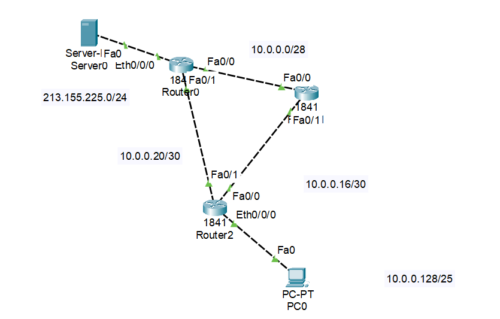
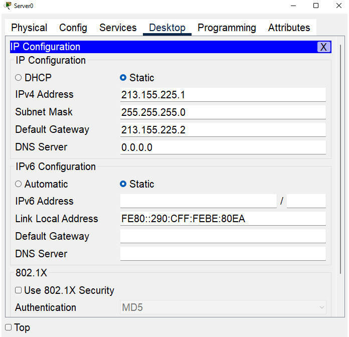
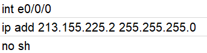

# Schéma sítě

# Postup:
**1)** Polož všechny routery (1841), server a PC
> **Poznámka:** V routerech, které vedou do PC a Serveru je nutné použít modul **WIC-1-ENET**

**2)** Nastav routerům IP adresu, serveru a PC pak ***default gateway***

> **Default Gateway** = IP adresa, která je přiřazená portu, kterým PC zapojujete do routeru, většinou tedy `Eth0/0/0` nebo `Eth0/1/0`

**3)** Nastav na routerech OSPF, na Routeru vedoucího do serveru pak default gateway (bude totiž používán jako hlavní brána k "Internetu"

> **Poznámka:** OSPF nastavíme všude kromě propojení PC se serverem, tam později nastavíme NAT

**4)** Portu vedoucímu do PC nastavíme **pasivní rozhraní** = s žádným dalším počítačem napojeným tímhle portem nepůjde router nastavovat

**5)** Na routeru vedoucím do serveru nastavíme NAT

**6)** Na routeru vedoucím do serveru nastavíme SSH, zabezpečíme přihlášení do routeru a příkaz `enable` opatříme heslem
# Praxe:
**1) Pokládání routerů**

Položíme routery **1841**, do routerů na obrázku popsaných jako **Router0 a Router2** připojíme modul `WIC-1-ENET` - Tím pak připojíme routery ke zbytku sítě
Pomocí blesku propojíme kabely

**2) Nastavování IP adres**

Dle zadání nastavujeme IP adresy na routerech
Postupujeme tímto způsobem:
```
  ena
  conf t
  int (název interface, se kterým chceme pracovat, v našem případě máme na výběr z F0/0, F0/1 a E0/0/0 (případně E0/1/0)
  ip add (požadovaná IP adresa) (požadovaná maska)
  no sh
```
**Poslední 2 příkazy zopakujeme pro každý interface, přes které jsou prvky propojeny**
> IP Cheat Sheet **ZDE:** [Cheat Sheet](https://www.freecodecamp.org/news/subnet-cheat-sheet-24-subnet-mask-30-26-27-29-and-other-ip-address-cidr-network-references/)
> 
> Kalkulačka IP adres **ZDE:** [Kalkulačka](https://www.calculator.net/ip-subnet-calculator.html) (můžete použít jakoukoliv z **Usable IP adresses**

**Nastavení Serveru/počítače a s ním souvisejícího routeru:**



