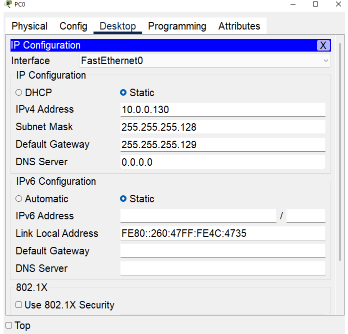
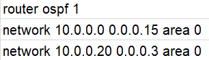

# Schéma sítě

# Postup:
**1)** Polož všechny routery (1841), server a PC
> **Poznámka:** V routerech, které vedou do PC a Serveru je nutné použít modul **WIC-1-ENET**

**2)** Nastav routerům IP adresu, serveru a PC pak ***default gateway***

> **Default Gateway** = IP adresa, která je přiřazená portu, kterým PC zapojujete do routeru, většinou tedy `Eth0/0/0` nebo `Eth0/1/0`

**3)** Nastav na routerech OSPF, na Routeru vedoucího do serveru pak default gateway (bude totiž používán jako hlavní brána k "Internetu"

> **Poznámka:** OSPF nastavíme všude kromě propojení PC se serverem, tam později nastavíme NAT

**4)** Portu vedoucímu do PC nastavíme **pasivní rozhraní** = s žádným dalším počítačem napojeným tímhle portem nepůjde router nastavovat

**5)** Na routeru vedoucím do serveru nastavíme NAT

**6)** Na routeru vedoucím do serveru nastavíme SSH, zabezpečíme přihlášení do routeru a příkaz `enable` opatříme heslem
# Praxe:
## **1) Pokládání routerů**

Položíme routery **1841**, do routerů na obrázku popsaných jako **Router0 a Router2** připojíme modul `WIC-1-ENET` - Tím pak připojíme routery ke zbytku sítě
Pomocí blesku propojíme kabely

## **2) Nastavování IP adres**

Dle zadání nastavujeme IP adresy na routerech

Postupujeme tímto způsobem:
```
  ena
  conf t
  int (název interface, se kterým chceme pracovat, v našem případě máme na výběr z F0/0, F0/1 a E0/0/0 (případně E0/1/0)
  ip add (požadovaná IP adresa) (požadovaná maska)
  no sh
```
**Poslední 2 příkazy zopakujeme pro každý interface, přes které jsou prvky propojeny**
> IP Cheat Sheet **ZDE:** [Cheat Sheet](https://www.freecodecamp.org/news/subnet-cheat-sheet-24-subnet-mask-30-26-27-29-and-other-ip-address-cidr-network-references/)
> 
> Kalkulačka IP adres **ZDE:** [Kalkulačka](https://www.calculator.net/ip-subnet-calculator.html) (můžete použít jakoukoliv z **Usable IP adresses**)

**Nastavení Serveru/počítače a s ním souvisejícího routeru:**

**Server**


**Router**


**PC**



## **3) Nastavování OSPF**

Na každém routeru se pomocí příkazu `network` ujistíme, že router zná všechny sítě, se kterými sousedí - jedinou výjimkou je propojení **Router-Server**, to do OSPF nepřidáváme

Postupujeme tímto způsobem:
```
  router ospf 1
  network (Network adresa sítě - první adresa) (opačná maska sítě - wildcard mask) area 0
```

**Ukázka (platí pro Router0):**



Pak přejdeme na Router0 a nastavíme **default gateway**

```
  ip route 0.0.0.0 0.0.0.0 (2x 0.0.0.0 určuje že se bude jednat o default gateway) 213.155.225.1 (adresa serveru)
  default-information originate
```

Toto nastaví default gateway všem routerům

## **4) Pasivní rozhraní**

Stačí pouze vlézt na router připojený k pc a zadat příkazy:

```
  router ospf 1
  passive-interface e0/0/0 (případně e0/1/0)
```

## **5) Nastavení NAT na řídícím routeru**

První nastavíme na routeru který interfaces jsou vnitřní a vnější (vnější = tam kde je internet, vnitřní = tam kde je naše síť)

```
  int f0/0
  ip nat inside
  int f0/1
  ip nat inside
  int e0/0/0 (případně int e0/1/0)
  ip nat outside
```

Pak určíme, které IP adresy může používat (*první příkaz*) a povolíme jejich využití v NATU (*druhý příkaz*), v tomto případě povolujeme síť **10.0.0.0** s wildcard maskou **0.0.0.255**


```
  access-list 1 permit 10.0.0.0(network adresa sítě) 0.0.0.255(opačná (wildcard) maska sítě - v tomto případě pro 256 IP adres, A.K.A /24)
  ip nat inside source list int e0/0/0
```

## **6) Nastavení SSH, zabezpečení řídícího routeru**

Nejprve nastavíme hesla na SSH, enable, a konzoli:

```
  username cisco password cisco (nastaví uživatelské jméno a heslo)
  enable secret cisco (nastaví heslo k režimu ena)
  service password-encryption (zašifruje heslo)
```

Pak tyto hesla zapneme pro SSH a Konzoli:

```
  line con 0
  login local
  line vty 0 15
  login local
```

Pak nastavíme SSH:

```
  hostname Gru
  ip domain-name blog.iservery.com
  crypto key generate rsa
  (nějaký text s délkou klíče): 2048
  ip ssh version 2
  line vty 0 15
  transport input ssh
```

# **A je hotovo! Díky za pozornost!**
